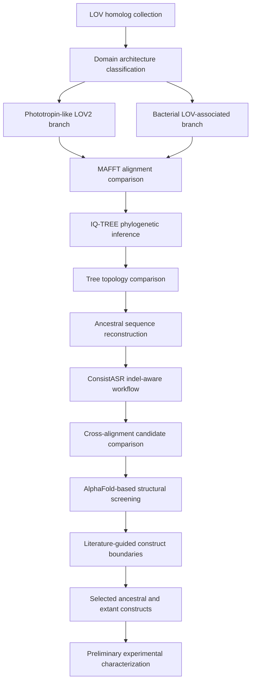

# Evolutionary Design Principles of LOV-Domain Photoreceptors

## Project Goal

This repository documents an undergraduate graduation research project on the
evolutionary design principles of light-oxygen-voltage (LOV) photoreceptor
proteins.

The project uses phylogenetic analysis and ancestral sequence reconstruction
(ASR), sequence and structure analysis, and experimental characterization to
investigate LOV-domain diversification. ASR is used to identify experimentally
testable ancestral constructs rather than as an endpoint by itself. The main
comparison focuses on three signaling architectures:

- phototropin-like LOV2 proteins, represented by AsLOV2
- LOV-STAS proteins, represented by YtvA
- LOV-HTH proteins, represented by EL222

The broader goal is to investigate how a conserved LOV sensory core may have
become coupled to different signaling regions during evolution, and how those
evolutionary hypotheses can be examined through comparison of ancestral and
extant proteins.

## Scientific Motivation

LOV domains share a conserved flavin-binding sensory fold but occur in proteins
with different signaling partners and regulatory mechanisms. Comparing
reconstructed ancestors with extant reference proteins provides a way to
generate testable hypotheses about which sequence and structural features were
retained or changed as these signaling architectures diversified.

The project connects three levels of analysis: evolutionary history inferred
from sequence and phylogenetic evidence, structural hypotheses from reconstructed
proteins, and experimental characterization of selected ancestral/extant pairs.

## Research Question

> How did a conserved LOV light-sensing core diversify across different
> signaling architectures, and can reconstructed ancestral proteins provide
> testable candidates for studying that diversification?

The computational analysis generates candidates and hypotheses. It does not by
itself establish ancestral biochemical properties, photochemical kinetics,
expression behavior, or biological function.

## Status

Computational candidate-selection and construct-design stages are complete.
Three ancestral candidates and three extant reference constructs have been
defined for downstream comparison.

Preliminary laboratory work has started for the AsLOV2 ancestral/extant pair,
with expression, purification, and spectroscopy in progress. Conditions and
measurements are still being optimized; no validated comparative conclusion has
been reached. Raw experimental data are not included in this repository.

See [`docs/project_status.md`](docs/project_status.md) for a concise progress
summary.

## Repository Usage

- Start with this README and [`docs/project_status.md`](docs/project_status.md).
- Use `trees/` and `trees/comparison/` for phylogenetic outputs and topology comparisons.
- Use `constructs/` for candidate sequences and convergence summaries.
- Use `results/construct_design/` for construct rationale and final FASTA records.

Large intermediates, raw structure-prediction outputs, and raw experimental
records are maintained outside this repository.

## Dataset Overview

| Branch | Biological scope | Architectures in candidate analysis |
|---|---|---|
| Phototropin-like LOV2 | Plant-like phototropin sequences related to AsLOV2 | Phototropin-like LOV2 |
| Bacterial LOV-associated | Bacterial LOV proteins grouped by signaling region | LOV-STAS, LOV-HTH, LOV-HK |

## Computational Workflow

Key steps: LOV homolog collection and domain classification → MAFFT alignment
(AUTO, L-INS-i, E-INS-i, G-INS-i) → IQ-TREE phylogenetic inference and topology
comparison → ASR with ConsistASR indel-aware refinement → cross-alignment
candidate convergence and AlphaFold screening → literature-guided construct
boundary mapping → final FASTA preparation → preliminary experimental
characterization.

Software tools and versions are listed in
[`docs/software_environment.md`](docs/software_environment.md).

## Repository Structure

| Path | Contents |
|---|---|
| `constructs/` | Candidate ancestral sequences, pairwise identity summaries, consensus comparisons, and construct-design working files |
| `constructs/bacterial/` | Bacterial LOV-STAS, LOV-HTH, and LOV-HK ancestral candidates |
| `constructs/plant/` | Plant phototropin-like ancestral candidates from multiple alignment strategies |
| `constructs/construct_design/` | Reference sequences, alignments, extraction script, and intermediate outputs |
| `results/construct_design/` | Reviewed construct rationale and final construct records |
| `results/construct_design/final_order_fastas/` | Combined FASTA files for selected constructs |
| `trees/` | Bacterial and plant IQ-TREE tree files |
| `trees/comparison/` | Pairwise topology comparison tables and matrices |
| `scripts/` | Domain-architecture classification utility |
| `docs/` | Project progress and repository-scope documentation |

## Candidate Selection

The selected ancestral design sources were:

- plant phototropin-like: `plant_linsi_Node62`
- LOV-STAS: `bacterial_ginsi_STAS_Node227`
- LOV-HTH: `bacterial_ginsi_HTH_Node83`

Evaluation criteria included sequence convergence across alignment strategies,
LOV cysteine conservation, indel-aware sequence composition, AlphaFold
structural plausibility, and compatibility with literature construct boundaries.
LOV-HK candidates are retained in the repository but not included in the
current six-construct set.

Pairwise identity tables: `constructs/plant_pairwise.tsv`,
`constructs/stas_pairwise.tsv`, `constructs/hth_pairwise.tsv`.

## Selected Constructs

| Construct | Reference boundary | Length | Status |
|---|---:|---:|---|
| `WT_AsLOV2_404_560` | AsLOV2 404–560 | 157 aa | Preliminary lab work ongoing |
| `AncPlant_Node62_AsLOV2_404_560eq` | AsLOV2 404–560 equivalent | 157 aa | Preliminary lab work ongoing |
| `WT_YtvA_20_147` | YtvA 20–147 | 128 aa | Design prepared |
| `AncSTAS_Node227_YtvA_20_147eq` | YtvA 20–147 equivalent | 128 aa | Design prepared |
| `WT_EL222_1_163` | EL222 1–163 | 163 aa | Design prepared |
| `AncHTH_Node83_EL222_1_170eq` | EL222 1–170 equivalent | 148 aa | Design prepared |

Detailed boundary rationale: [`results/construct_design/README.md`](results/construct_design/README.md).
Final FASTA records: [`results/construct_design/final_order_fastas/all_WT_and_ancestral_order_constructs.fasta`](results/construct_design/final_order_fastas/all_WT_and_ancestral_order_constructs.fasta).

## Structural Evaluation

AlphaFold-based predictions were used as a computational screening layer for
fold conservation and domain organization. Structure prediction was one
component of candidate selection and was not treated as evidence of biochemical
activity or experimental structural validation. Raw outputs are maintained
outside this repository.

## Scope, Limitations, and Next Steps

Current limitations include incomplete provenance documentation for the initial
sequence collection, unrecorded intermediate filtering counts, and node
identifiers that must always be interpreted alongside their source analysis.
Phylogenetic reconstruction and AlphaFold prediction generate hypotheses;
neither substitutes for experimental validation.

Planned next steps: maintain a canonical construct manifest with source and
boundary rationale; record exact software versions, commands, and input
provenance; continue controlled expression, purification, and spectroscopy
comparisons; add raw experimental data only after organizing with clear
provenance; and compare future measurements with computational hypotheses
without overstating agreement.
