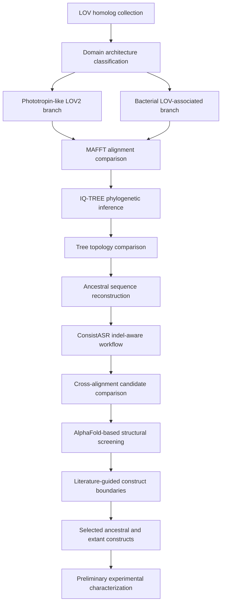

# Evolutionary Design Principles of LOV-Domain Photoreceptors

## Project Goal

This repository documents an undergraduate graduation research project on the
evolutionary design principles of light-oxygen-voltage (LOV) photoreceptor
proteins.

The project uses phylogenetic analysis and ancestral sequence reconstruction
(ASR), sequence and structure analysis, and experimental characterization to
investigate LOV-domain diversification. ASR is used to identify experimentally
testable ancestral constructs rather than as an endpoint by itself. The main
comparison focuses on three signaling architectures:

- phototropin-like LOV2 proteins, represented by AsLOV2
- LOV-STAS proteins, represented by YtvA
- LOV-HTH proteins, represented by EL222

The broader goal is to investigate how a conserved LOV sensory core may have
become coupled to different signaling regions during evolution, and how those
evolutionary hypotheses can be examined through comparison of ancestral and
extant proteins.

## Scientific Motivation

LOV domains share a conserved flavin-binding sensory fold but occur in proteins
with different signaling partners and regulatory mechanisms. Comparing
reconstructed ancestors with extant reference proteins provides a way to
generate testable hypotheses about which sequence and structural features were
retained or changed as these signaling architectures diversified.

The project therefore connects three levels of analysis:

- evolutionary history inferred from sequence and phylogenetic evidence
- structural hypotheses generated from reconstructed proteins
- experimental characterization of selected ancestral/extant pairs

## Research Question

The central research question is:

> How did a conserved LOV light-sensing core diversify across different
> signaling architectures, and can reconstructed ancestral proteins provide
> testable candidates for studying that diversification?

The computational analysis is used to generate candidates and hypotheses. It
does not by itself establish ancestral biochemical properties, photochemical
kinetics, expression behavior, or biological function.

## Current Status

The computational candidate-selection and construct-design stages represented
in this repository are complete. Three ancestral candidates and three
corresponding extant reference constructs have been defined for downstream
comparison.

Preliminary laboratory work has started for the AsLOV2 ancestral/extant pair,
with expression, purification, and spectroscopy in progress. Experimental
conditions and measurements are still being optimized and repeated, and no
validated comparative conclusion has been reached.

Raw experimental data have not been uploaded to this repository. In
particular, this repository currently contains no:

- UV-visible absorption spectra
- dark-recovery kinetic measurements
- SDS-PAGE or gel images
- protein purification chromatograms
- cloning, expression, or purification records
- laboratory notebook data

No experimental validation claim should be inferred from the computational
candidate selection or structure-prediction assessment documented here.

See [`docs/project_status.md`](docs/project_status.md) for a concise progress
summary.

## Repository Usage

This repository is a compact, reviewable record of the computational
candidate-selection and construct-design work.

- Start with this README and [`docs/project_status.md`](docs/project_status.md)
  for scientific scope and current status.
- Use `trees/` and `trees/comparison/` to inspect retained phylogenetic outputs
  and topology comparisons.
- Use `constructs/` to inspect candidate sequences and convergence summaries.
- Use `results/construct_design/` for the reviewed construct rationale and
  current selected FASTA records.
- Treat scripts as analysis utilities whose outputs should be written to a
  separate working directory.

Large intermediates, raw structure-prediction outputs, and raw experimental
records are intentionally maintained outside this GitHub repository.

## Dataset Overview

The phylogenetic and ASR analyses were organized into two broad branches:

| Branch | Biological scope | Architectures carried into candidate analysis |
|---|---|---|
| Phototropin-like LOV2 | Plant-like phototropin sequences related to AsLOV2 | Phototropin-like LOV2 |
| Bacterial LOV-associated | Bacterial LOV proteins grouped by associated signaling regions | LOV-STAS, LOV-HTH, and LOV-HK |

The branches were analyzed separately because their sequence lengths, domain
architectures, and evolutionary contexts differ. The final selected construct
set includes a phototropin-like candidate, a LOV-STAS candidate, and a LOV-HTH
candidate. LOV-HK candidates were evaluated computationally but were not
carried into the current selected construct set.

## Computational Workflow

The computational and experimental workflow is:

1. Collect LOV-containing protein homologs using representative query proteins.
2. Classify candidate proteins by LOV-associated domain architecture.
3. Filter and separate plant-like and bacterial sequence datasets.
4. Generate multiple sequence alignments with MAFFT AUTO, L-INS-i, E-INS-i,
   and G-INS-i.
5. Infer phylogenetic trees with IQ-TREE.
6. Compare tree topologies across alignment strategies.
7. Perform ancestral sequence reconstruction.
8. Apply indel-aware sequence refinement through the ConsistASR workflow.
9. Extract candidate ancestral nodes from multiple alignment/tree conditions.
10. Compare candidate convergence using pairwise sequence identity.
11. Assess candidate structural plausibility using AlphaFold-based predictions.
12. Map selected ancestral sequences to literature-supported reference
    construct boundaries.
13. Prepare final extant and ancestral construct FASTA records.
14. Begin experimental comparison through expression, purification, and
    spectroscopic characterization.

## Workflow Overview

Software tools and locally verified versions are listed in
[`docs/software_environment.md`](docs/software_environment.md).

## Completed In Silico Work

The following computational stages are represented by files in this
repository:

- LOV architecture classification utility and curated candidate groupings
- bacterial and plant phylogenetic trees from four MAFFT alignment strategies
- pairwise tree-topology comparison tables
- ancestral candidate sequences from multiple reconstruction conditions
- indel-aware candidate selection carried forward from the working analysis
- pairwise sequence-identity and convergence summaries
- consensus sequences used as comparison artifacts
- reference-coordinate construct extraction
- construct-boundary rationale for AsLOV2, YtvA, and EL222 systems
- final FASTA records for six proposed expression constructs

Large working files, raw alignment runs, ASR state files, indel-aware
intermediates, and raw AlphaFold outputs are not included in this compact
GitHub repository.

Raw experimental records are maintained outside this repository, and
preliminary laboratory work is not counted as a completed validated result
here.

## Repository Structure

| Path | Contents |
|---|---|
| `constructs/` | Candidate ancestral sequences, pairwise identity summaries, consensus comparisons, metadata, and construct-design working files |
| `constructs/bacterial/` | Candidate bacterial LOV-STAS, LOV-HTH, and LOV-HK ancestral sequences evaluated during selection |
| `constructs/plant/` | Plant phototropin-like ancestral candidates from multiple alignment strategies |
| `constructs/construct_design/` | Reference sequences, alignments, extraction script, and intermediate construct outputs |
| `results/construct_design/` | Reviewed construct-design rationale and final construct records |
| `results/construct_design/final_order_fastas/` | Combined FASTA files for the selected extant and ancestral constructs |
| `trees/` | Bacterial and plant IQ-TREE tree files |
| `trees/comparison/` | Pairwise topology comparison tables and matrices |
| `scripts/` | Domain-architecture classification utility |
| `docs/` | Project progress and repository-scope documentation |

## Alignment and Phylogenetic Robustness

Four MAFFT strategies were compared:

- AUTO
- L-INS-i
- E-INS-i
- G-INS-i

The repository contains IQ-TREE tree files for bacterial and plant datasets and
pairwise topology summaries under `trees/comparison/`. These comparisons were
used to assess alignment sensitivity and to avoid basing candidate selection on
a single alignment condition.

The topology tables show that the inferred trees are not identical across
alignment methods. They therefore support comparative robustness assessment,
not a claim that one unique evolutionary topology has been conclusively
established.

## Candidate Selection

Candidate evaluation considered:

- sequence convergence across alignment strategies
- preservation of the conserved LOV cysteine
- consistency with the relevant LOV architecture
- indel-aware reconstructed sequence length and composition
- structural plausibility in AlphaFold-based predictions
- interpretability of the selected phylogenetic node
- compatibility with literature-supported experimental boundaries

The selected ancestral design sources carried into final construct preparation
were:

- plant phototropin-like candidate: `plant_linsi_Node62`
- LOV-STAS candidate: `bacterial_ginsi_STAS_Node227`
- LOV-HTH candidate: `bacterial_ginsi_HTH_Node83`

LOV-HK candidates remain in the repository because they were evaluated during
the broader computational analysis, but no LOV-HK construct is included in the
current final six-construct set.

Pairwise identity tables are available at:

- `constructs/plant_pairwise.tsv`
- `constructs/stas_pairwise.tsv`
- `constructs/hth_pairwise.tsv`

These comparisons describe sequence convergence among reconstructed
candidates. They are not experimental measurements of protein performance.

## Selected Construct Design

Construct boundaries were chosen using modern reference proteins and retained
ancestral residues in reference-aligned coordinates. The designs include the
LOV core and an architecture-relevant C-terminal helix or linker where
appropriate.

| Construct | Reference boundary | Length | Design status |
|---|---:|---:|---|
| `WT_AsLOV2_404_560` | AsLOV2 404-560 | 157 aa | Preliminary laboratory work ongoing |
| `AncPlant_Node62_AsLOV2_404_560eq` | AsLOV2 404-560 equivalent | 157 aa | Preliminary laboratory work ongoing |
| `WT_YtvA_20_147` | YtvA 20-147 | 128 aa | Design prepared |
| `AncSTAS_Node227_YtvA_20_147eq` | YtvA 20-147 equivalent | 128 aa | Design prepared |
| `WT_EL222_1_163` | EL222 1-163 | 163 aa | Design prepared |
| `AncHTH_Node83_EL222_1_170eq` | EL222 1-170 equivalent | 148 aa | Design prepared |

Detailed boundary rationale is provided in
[`results/construct_design/README.md`](results/construct_design/README.md).
The combined final records are stored in
[`results/construct_design/final_order_fastas/all_WT_and_ancestral_order_constructs.fasta`](results/construct_design/final_order_fastas/all_WT_and_ancestral_order_constructs.fasta).

The table combines construct-design status with the current high-level project
stage. Preliminary laboratory work has begun for the AsLOV2 ancestral/extant
pair, but the underlying experimental files are not included here. These labels
do not indicate validated expression, purification, folding, or photochemical
behavior.

## Structural Evaluation

AlphaFold-based predictions were used as a computational screening layer for
fold conservation, domain organization, and the plausibility of terminal
helical or linker regions. Structure prediction was one component of candidate
selection and was not treated as evidence of biochemical activity or
experimental structural validation.

Raw AlphaFold output directories are maintained outside this GitHub repository.

## Experimental Status

Experimental work on the AsLOV2 ancestral/extant pair is ongoing and
preliminary. Expression, purification, and spectroscopy workflows are in
progress, with experimental conditions and measurements being optimized and
repeated.

These activities establish the current experimental stage, not a final result.
The available records do not yet support validated conclusions about
comparative expression, purification, spectroscopy, photochemical behavior, or
dark-recovery kinetics. Results from these activities are not reported in this
repository because the corresponding raw data and analysis records have not
been uploaded.

When experimental records are added, computational predictions should be
clearly separated from observed measurements, and each conclusion should be
linked to its underlying raw data.

## Scope and Limitations

- Initial sequence collection included manual screening and requires a more
  complete provenance table for publication-level reproducibility.
- Exact initial BLAST hit counts and all intermediate filtering counts are not
  currently documented in this repository.
- Node identifiers can differ among alignment and tree reconstructions; node
  names should always be interpreted together with their source analysis.
- Consensus sequences are comparative summaries and were not automatically
  selected as expression constructs.
- Phylogenetic reconstruction and AlphaFold prediction generate hypotheses;
  neither substitutes for experimental validation.
- No conclusion about ancestral dark recovery, spectral properties, stability,
  oligomeric state, or signaling function is claimed at this stage.

## Next Steps

1. Maintain a canonical construct manifest linking each final construct to its
   source reconstruction and boundary rationale.
2. Record exact software versions, commands, input provenance, and checksums.
3. Continue controlled ancestral/extant expression, purification, and
   spectroscopy comparisons.
4. Add raw experimental data and analysis documentation only after they are
   organized with clear provenance.
5. Compare future measurements with the computational hypotheses without
   overstating agreement or causation.
